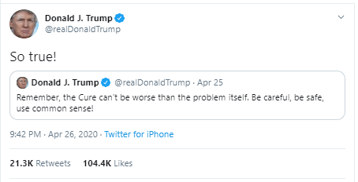

# Donald Trump's influence during Covid: How bad can be the communication's impact of a leader?

## Abstract :

Donald Trump’s many tweets during the Covid pandemic spread like wildfire, probably making him one of the most influential figures during the pandemic. But was he truly so influential? Will causal analyses of the effect of Trump’s tweets on Google queries show that he was leading or following online trends? Also, does the topic or sentiment of his tweet influence its popularity? Conversely, can we show that Trump’s tweeting is rather a mirror of global trends or other exogenous factors? Our goal is to study the impact an influential leader can have on information spread in a crisis with a focus on fake news, as an overload of misleading or contradictory statements (an infodemic, as [WHO](https://www.who.int/health-topics/infodemic#tab=tab_1) calls it) are known to have a detrimental impact on crisis management. Trump the Trend Maker or Trump the Follower, that is the question!

For a didactic presentation of our work, please check our [Data Story](https://mellopietro.github.io/adadakadavra-datastory/#topic=2&lambda=1&term=)!

## Research questions

- Was Donald Trump a trend maker or a follower: can we spot a correlation or even causality between his declarations and online trends, i.e.  Wikipedia or Google Trends page views?
- Do his tweets have a more significant impact on information spread when they convey fake news, or when they are negative?
- Can we predict Trump’s tweeting behavior as a function of exogenous factors, e.g. mobility restrictions or a rise in Covid cases?
    
## Proposed additional datasets

To conduct the analysis, we'll complete the given dataset with the following:

- Donald Trump's tweet between 2019 and
  2021: [Kaggle](https://www.kaggle.com/datasets/codebreaker619/donald-trump-tweets-dataset),
- Another data set from Kaggle, giving this time a sample of 30 000 American tweets per day,
- List of known fake news and their Google trends'
  reference : [GitHub](https://github.com/epfl-dlab/fact-checkers-fact-check/blob/main/data/kg_ids.json),
- Data extracted from Google Trends and Wikipedia,
- Evolution of the number of new cases, from [Kaggle](https://www.kaggle.com/datasets/niketchauhan/covid-19-time-series-data?select=time-series-19-covid-combined.csv).

The first dataset is composed of Donald Trump tweets until 2021. It has very few
missing values and also includes information such as the number of likes and
retweets, and whether the tweet has been deleted or not (which could be an
indicator of fake information). Similarly, the second data set gives a sample of tweets 
in the US. We only used the tweet content and its date for this data set.
The third addition is a mapping between claim clusters and knowledge graph ids.
Ribeiro et al. regrouped fact-checks from a dataset provided by the IFCN into 39
clusters (e.g. with topic ‘alcohol’), which they matched with entities in Google
Knowledge Graph, allowing us to search time series associated with the claims on
Google Trends.
Next, we directly searched for pageviews time series for a few specific articles on
Wikipedia or queries on Google Trends to conduct a more fine-grained analysis of
information spread. This allowed us to track the evolution of pageviews for specific
topic such as hydroxychloroquine on Wikipedia for instance.
Finally, the last data set was used to get time series of the number of new cases in the US.

## Method
The purpose of our analysis is to study the impact of Donald Trump’s tweets on the
popularity of online content. To achieve this, we will take the following steps.
First, we will conduct a causal impact study of Trump’s Covid-related tweets on
Wikipedia and Google Trends pageviews for several topics (e.g. ‘Covid’). In practice,
we will start by gathering all the tweets mentioning for instance
‘hydorxychloroquine’ in the Kaggle tweet dataset mentioned earlier. We will then
study the causal impact of each of these tweets on the associated Wikipedia/Google
Trends timeseries on this topic using the [Causal Impact library](https://google.github.io/CausalImpact/CausalImpact.html). This library allows us to
assess the impact of an intervention, i.e. a tweet by Trump, by comparing the
evolution of the time series of interest with that of a few other control time series.
For the control time series, we chose a set of ten popular non Covid-related topics
such as ‘Google’.
Second, to try to answer the question: ‘Was Trump a trend maker or a follower?’, we
would like to conduct a [Granger causality test](https://en.wikipedia.org/wiki/Granger_causality) to assess whether Trump’s tweets
are a good predictor of online trends or the other way around.
Finally, to give more insight into Trump’s influence, we would like to redo the Causal
Impact/Granger causality analysis using other causal factors such as official
announcements or mobility restrictions. For the former, we will use the interventions
of the Coronawiki dataset (e.g. first Covid case) and manually search for a few key
milestones/announcements if that proves relevant. For the mobility restrictions, we
will use the Apple and Google mobility reports to compute mobility and normality
changepoints in a similar fashion as our reference paper ‘Sudden Attention Shifts on
Wikipedia During the COVID-19 Crisis’.

The purpose of our analysis is to study the impact of Donald Trump’s tweets on the popularity of online content. To achieve this, we took the following steps: 
    1. We contextualized the problem with some plots showing the co-evolution of online traffic and mobility during the pandemic. We measured online traffic using Wikipedia page view statistics. Mobility, on the other hand, was measured using Google mobility reports.
    2. We performed some preliminary analyses of Trump’s tweets. Which words are more frequent? What is the evolution of the number of tweets/retweets during the pandemic? What about Covid-related tweets? All these analyses consisted in basic manipulation and plotting using the dataset with Trump’s tweets.
    3. We clustered Trump’s tweets into topics, after reducing dimensionality with Latent Dirichlet Allocation. For this, we used [Gensim](https://radimrehurek.com/gensim/), an open-source library for natural language processing.
    4. We then conducted a [Granger causality test](https://en.wikipedia.org/wiki/Granger_causality) between Trump’s tweets and the evolution of Wikipedia page views for popular topic related to fake news: ‘hydroxychloroquine’. In practice, we started by gathering all the tweets mentioning ‘hydorxychloroquine’ in the Kaggle tweet dataset mentioned earlier. We then performed a Granger causality tests between the two time series, using the statsmodels library, a Python module providing a range of statistical tools.
    5. We then conducted a causal impact study of Trump’s Covid-related tweets on Google Trends queries, again for ‘hydroxychloroquine’. We then studied the causal impact of of the first of Trump’s tweets on the subject during the pandemic on the associated Google Trends time series on this topic using the [Causal Impact library](https://google.github.io/CausalImpact/CausalImpact.html). This library allows us to assess the impact of an intervention, i.e. a tweet by Trump, by comparing the evolution of the time series of interest with that of a few other control time series. For the control time series, we chose a set of five popular non Covid-related topics such as ‘Climate’  after verifying that assumption for conducting the test were verified. We then performed the exact same Causal Impact analysis, using another intervention: the first mobility changepoint in the US, as measured by Manoel et al.
    6. Using [VADER](https://www.analyticsvidhya.com/blog/2021/06/vader-for-sentiment-analysis/), a rule-based sentiment analyzer specific for social media text, we then analyzed the sentiment of Trump’s topics.
    7. We then trained linear regression model from the statsmodel library to predict the number of retweets as a function of sentiment and tweet topic. The topic of tweet was found manually, by looking for tweets mentioning a set of words we thought matched the topic of interest (e.g. ‘Biden’).
    8. Finally, we trained a logistic regression model to predict the sentiment of Trump’s tweet (negative/positive) as a function of the rise in the number of Covid cases and the overall sentiment of American tweets over the period of interest.

## Executed timeline
We organized our team in subgroups of 2 to 3 people working on parts of the
project. We meet twice a week to put our respective contributions to gather and
discuss our progress and future steps.
We propose a timeline structured in two-week intervals until late December (the
people assigned to the task are in italic):
- Nov 17, Milestone 2 submission;
- Dec 1, Discuss feedback from Milestone 2 and apply required changes to
existing notebook, gather a list of
topics/news/announcements/key Covid-related events to focus our analysis
on, learn the basics of website creation;
- Dec 15, Complete the analysis in the Notebook code with helpfer functions +
graphs, Make a first draft of the data story;
- Dec 22, Ask for final feedback, detail/clarify the explanations (in English) and
the comments in the Notebook and polish the data story website.

## Contributions
- Pietro : Set up the website and focused on the context plots
- Michel Angelo: Conducted Trump’s tweet analysis and LDA for topics
- Sabri: Focused on the causal analysis and the study of Granger causality
- Etienne: Focused on using the retweets to assess Trump’s influence, based on topics and sentiment analysis
- Matteo: Proposed to predict the sentiments of Trump’s tweet from external data, studied the evolution of sentiments over time

